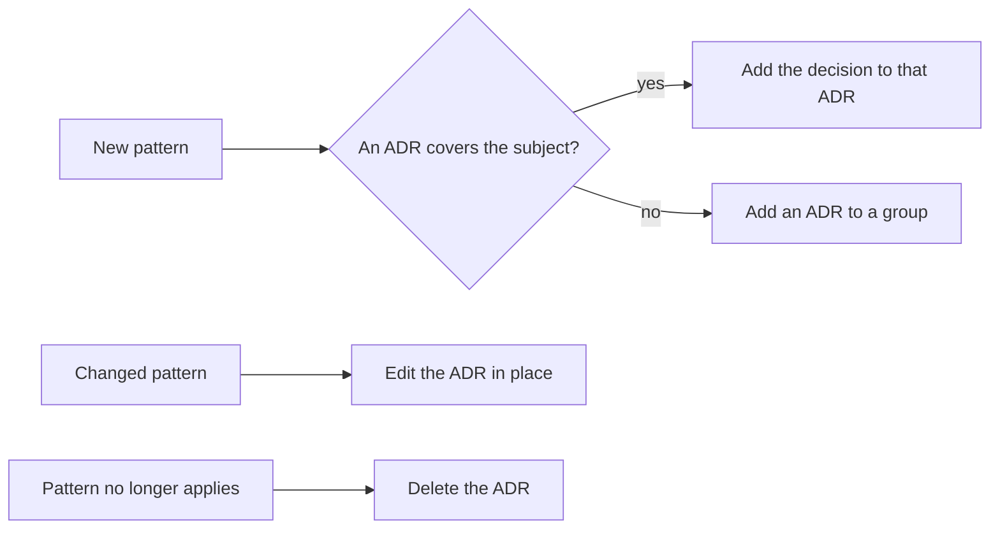

# Docs

These docs record project knowledge that the code does not make clear.

## Architecture decision records

The [`adr/`](adr/) folder holds the patterns that this codebase follows, and the reasons for them.
Read these records before you add code. The table shows the records in groups. The numbers follow
the groups.

### Code structure

| # | Decision |
|---|---|
| [ADR-1](adr/ADR-1-feature-packages-and-file-layout.md) | Features are packages at the root. A component is one file, or a folder when it has parts. The modules of the app are blocks in `blocks/`. |
| [ADR-2](adr/ADR-2-internal-by-default.md) | All declarations that other modules do not call are `internal` |

### UI

| # | Decision |
|---|---|
| [ADR-3](adr/ADR-3-composable-conventions.md) | Composables: files, previews, screens, state classes and the data that a Composable takes |
| [ADR-6](adr/ADR-6-design-system-module.md) | The design system is the `:blocks:designsystem` module. Figma is the source of its tokens. |

### Network

| # | Decision |
|---|---|
| [ADR-7](adr/ADR-7-rpc-block.md) | The `rpc` block sends the RPC requests: Ktor, the session id plugin and the wire format |

### Build

| # | Decision |
|---|---|
| [ADR-4](adr/ADR-4-gradle-daemon-on-corretto-from-direct-links.md) | The Gradle daemon runs on Amazon Corretto, from direct CDN links |

### Docs

| # | Decision |
|---|---|
| [ADR-5](adr/ADR-5-write-docs-in-simplified-technical-english.md) | Write docs in Simplified Technical English, with Mermaid diagrams |

The diagram shows how an ADR changes.

To add a decision, do these steps:

1. Find the group of the decision. If an ADR of the group covers the same subject, add the
   decision to that ADR. Then stop.
2. Copy [`adr/template.md`](adr/template.md) to `adr/ADR-<number>-<title-in-kebab-case>.md`.
   Use the next free number, for example `ADR-8-cache-the-torrent-list.md`.
3. Complete the sections of the new file.
4. Add a row for the new ADR to the table of its group. Add a group if no group fits.

To change a decision, edit the ADR in place. When a decision no longer applies, delete the ADR and
its row. The git history keeps the old versions. Do not keep superseded ADRs.

After each change, update the links in the other ADRs, in `AGENTS.md` and in `docs/reference/`.

## Proposals

The [`proposals/`](proposals/) folder holds ideas that the team has not decided yet. A proposal
gives the problem, the options and the proposed solution. Do not implement an open proposal.

| # | Proposal | Status |
|---|---|---|
| [PROPOSAL-1](proposals/PROPOSAL-1-server-configuration-storage.md) | Store the server configurations in multiplatform-settings, and passwords in secure storage | Open |

To add a proposal, do these steps:

1. Create `proposals/PROPOSAL-<number>-<title-in-kebab-case>.md`. Use the next free number.
2. Give these sections: Problem, Options, Proposal, Consequences and Open questions.
3. Set the status to "Open".
4. Add a row for the new proposal to the table above.

When the team accepts a proposal, do these steps:

1. Write an ADR that records the decision.
2. Set the status of the proposal to "Accepted as ADR-N".

When the team rejects a proposal, set its status to "Rejected" and give the reason in the file.

## References

The [`reference/`](reference/) folder holds external material that the code relies on.

- [Features](reference/features.md): the features of this app, with the status, the package and
  the RPC methods of each feature. The list includes planned features.
- [Design system](reference/design-system.md): the tokens, the icons and the components of the
  `:blocks:designsystem` module, and their names in Figma.
- [Documentation](reference/documentation.md): how to write the docs, the comments and the commit
  messages. It gives the STE modes, the words of this project and the rules for Mermaid diagrams.
- [Transmission RPC API](reference/transmission-rpc-api.md): the two wire formats (JSON-RPC 2.0 for
  4.1+, legacy for ≤ 4.0) and the session-id handshake. It also gives all methods and fields, and
  notes for this client.
