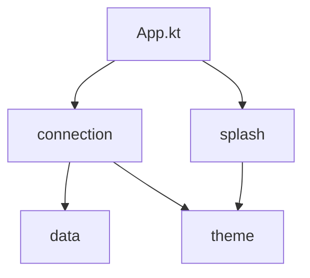

# ADR-1: Feature packages and file layout

- **Status:** Accepted
- **Date:** 2026-10-07

## Context

The source tree must answer two questions:

- **Where is a feature?** A feature package holds more than UI: its ViewModel and UI state now,
  and use cases and feature-only logic later. Thus a `ui/` package level would mislead. Each
  feature is also a likely future Gradle module ([ADR-2](ADR-2-internal-by-default.md)).
  The top level of the source tree must read as the list of features.
- **What belongs to what?** Some components fit in one file. Other components need helpers that
  nothing else uses: sub-Composables, mappers, utilities. When these helpers are next to unrelated
  files, a reader cannot tell what they belong to, or if a change to them is safe. A helper that a
  writer makes generic too early hides the opposite problem.

## Decision

### 1. The root package lists the features

The root package `eu.alsk.transmissionremote` holds `App.kt` and one package for each
**feature**. A feature is a part of the app that the user sees as a unit
(see [Features](../reference/features.md)). Each feature package has the name of the feature.

```
eu/alsk/transmissionremote/
├── App.kt                          entry point and top-level navigation
├── connection/                     feature            → later feature:connection
│   ├── ConnectionViewModel.kt      ViewModel
│   ├── ConnectionContentState.kt   the UI state that the ViewModel exposes
│   ├── ConnectionEvent.kt          the one-time events that the ViewModel sends
│   └── views/                      one screen, so its parts are here directly (section 3)
│       ├── ConnectionScreen.kt     ConnectionScreen (container) + ConnectionContent (renderer)
│       ├── FormField.kt
│       └── PasswordField.kt
├── splash/                         feature            → later feature:splash
│   └── views/
│       ├── SplashScreen.kt
│       └── AppLogo.kt
├── theme/                          shared UI          → later core:designsystem
│   └── Theme.kt
└── data/                           shared data        → later core:data / core:network
```

- There is no `ui/` package.
- Code that more than one feature uses is not a feature. Put it in a package at the root that has
  the name of its role: `theme/` for shared UI, `data/` for data and networking. Add a new role
  package only when a second feature needs the code.
- Give a feature a name that tells what the user does, for example `connection` or `torrents`. A
  feature name must not be the same as a role name.

The diagram shows the allowed dependencies between the packages.



`App.kt` connects the features.

### 2. The content of a feature package

A feature package `<feature>/` holds:

- the ViewModel of the feature, for example `ConnectionViewModel.kt`.
- the UI state that the ViewModel exposes, in its own file, for example
  `ConnectionContentState.kt`.
- the events that the ViewModel sends, in their own file, for example `ConnectionEvent.kt`.
- the use cases and other logic that only this feature uses.
- `views/`, with all Composables of the feature and their `<FunctionName>State` classes
  ([ADR-3](ADR-3-composable-conventions.md)).

A feature without a ViewModel, like `splash`, has only `views/`.

The package names are `eu.alsk.transmissionremote.<feature>` and
`eu.alsk.transmissionremote.<feature>.views[.<component>]`.

### 3. A component is one file, or a folder

A component is a ViewModel, a UI element, a use case or a repository.

- If a component fits in one file, the component **is one file**. The file has the name of the
  component, for example `ConnectionViewModel.kt`.
- If you divide a component into parts, the component becomes a **folder that has the name of the
  component**:
  - The folder holds the main file of the component. It also holds each file that only this
    component uses: sub-Composables, `<FunctionName>State` classes, mappers, utilities.
  - A Kotlin package name starts with a lower-case letter. Thus the folder uses the component name
    in camelCase. Example: `ConnectionScreen` → `connectionScreen/ConnectionScreen.kt`, package
    `…views.connectionScreen`.
- **Exception: one component in the package.** While a package such as `views/` holds only one
  component, the parts of that component are directly in the package. They have no component
  folder. When a second component comes, move the parts of the first component into a folder with
  its name. The second component also gets a folder if it has parts.
- When a **second** component starts to use a part, move the part next to the components that use
  it. The part becomes a component: a file, or a folder if it has parts.
- This rule applies to all kinds of components, and it nests. A part that gets parts becomes a
  folder in the folder of its owner.
- [ADR-3](ADR-3-composable-conventions.md) applies in a folder too: one non-trivial
  Composable in each file.

Today each feature has one screen. Thus `views/` holds the screen and its parts directly (see the
tree in section 1). This example shows `connection/views/` after we add a second screen:

```
connection/views/
├── connectionScreen/
│   ├── ConnectionScreen.kt
│   ├── FormField.kt
│   └── PasswordField.kt
└── ServerListScreen.kt                 one file. It becomes serverListScreen/ when it has parts.
```

## Consequences

- The root of the source tree lists the features. Each feature maps to a future
  `feature:<name>` module. The role packages map to `core:*` modules.
- A new feature gets a new root package. Do not add it as a sub-package of a feature.
- The tree shows ownership. A change to a file in the folder of a component has no effect on
  other components.
- The tree has no nesting until the nesting separates something.
- When you add a second component to a package, you also move the parts of the first component
  into its folder. This move is a rename plus import changes. In one module, this work is small.
- Reuse is a step that you do on purpose. When you move a part out of a folder, the move shows
  that other components now use the part.
