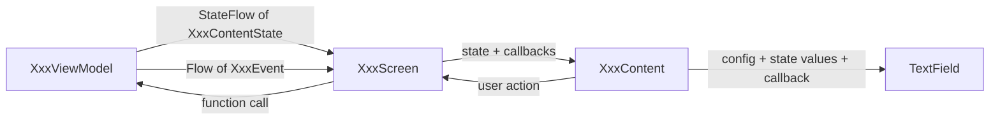

# ADR-3: Composable conventions

- **Status:** Accepted
- **Date:** 2026-10-07

## Context

This ADR holds all rules for Composables: files, previews, screens, state classes and the data
that a Composable takes. The rules solve these problems:

- **Long files.** When a screen grows, its file collects private helper Composables. The previews
  are then far from the code that they show. The helpers are hard to find and to reuse.
- **Long parameter lists.** Composables collect parameters: a label, a value, a placeholder, an
  error, a keyboard type. Some of these values change at runtime. The call site sets the other
  values, and they do not change. When one class holds both kinds, the caller must make a new object for each call.
  Most fields of that object are constants, and the class name says "state" for data that is
  not state.
- **Pass-through objects.** The easy way to give data to a Composable is to pass any object that
  is available: the whole state of the ViewModel, a domain model or a repository result. The
  Composable then depends on fields that it never reads, and recomposes when these fields change.
  It also starts to derive values itself, for example "show this error now?" or "build the URL".
  Previews must then build the whole upstream object and know its rules.

Previews are the cheapest way to check the UI on all platforms. This is true only when each
Composable has its own previews, and when the previews can build the state directly.

## Decision

The diagram shows the parts of one screen and the direction of the data.



### 1. One file for each non-trivial Composable

- Each non-trivial Composable has its own file. The file has the name of the Composable
  (`TextField` → `TextField.kt`).
- A Composable is trivial if it is a few lines of layout with no state and no logic. An example is
  a styled `Text` wrapper. A trivial Composable can stay in the file of the one Composable that
  uses it. If you are not sure, give the Composable its own file.

### 2. Previews

- The file of a Composable also holds the `@Preview` functions of that Composable:
  - Use the common annotation `androidx.compose.ui.tooling.preview.Preview`. Then the previews work
    for Android and for desktop.
  - Wrap each preview in `AppTheme`. For a light and dark pair, pass `darkTheme = false` and
    `darkTheme = true`. `uiMode` has an effect only on Android previews.
  - Make the preview functions `private`.
- Put the preview sample data in a file-level `private val dummy<ElementName>`, next to the
  previews. Examples are `dummyConnectionContentState`, `dummyConnectionContentStateWithErrors`
  and `dummyPassword`. The previews use these values for state, not inline literals. Config
  values (see section 5) can be literals, as at a real call site.
- A Composable that opens a popup window, for example a dialog, a dropdown menu or a modal bottom
  sheet, needs a separate panel. The preview tools do not draw popup windows. Thus put the
  visible panel in a `private` Composable, for example `DialogPanel`. The public Composable shows
  the panel in the popup window. The previews show the panel directly.
- A Composable that takes a ViewModel has no previews. A preview would need a real ViewModel and
  its dependencies. The preview would also show only the initial state of the ViewModel.

### 3. Screens: `XxxScreen` and `XxxContent`

A screen has two Composables. Both Composables are in `XxxScreen.kt`:

- `XxxScreen` is the container:
  - It takes the ViewModel. It is the only Composable that touches the ViewModel.
  - It collects the state and gives the state to `XxxContent`.
  - It collects the events and reacts to them, for example with a snackbar.
  - It connects the callbacks to the ViewModel.
  - It has **no previews**.
- `XxxContent` shows the UI state:
  - It takes the state and the callbacks.
  - It is `private`, because only `XxxScreen` calls it.
  - Its previews show the important states, in light and in dark.

Example: `connection/views/ConnectionScreen.kt` holds `ConnectionScreen` and
`ConnectionContent`.

### 4. A Composable takes only the data that it shows

- The parameters of a Composable are exactly the data that it shows, plus the callbacks that it
  fires. This is the interface segregation principle, applied to the UI.
- Do not pass a ViewModel state, a domain model or a data class to a Composable that uses only a
  part of it. Do not pass such an object when the Composable must apply logic to it to get the
  data that it shows. Give the Composable its own state, ready to show:
  - For the renderer of a screen, `XxxContent`: a `XxxContentState`.
  - For other Composables: its state values as parameters, or a `<FunctionName>State` when it has
    more than two state values (see section 5).
- "Ready to show" means that the Composable does no business logic:
  - An error that the Composable must not show yet is already `null`.
  - The state already holds derived values, for example the RPC URL preview. A derived value is
    `null` when the Composable must not show it.
- Pass the callbacks one by one: one callback for each user action that the Composable can
  trigger.

### 5. State and config parameters

A Composable has these kinds of parameters:

| Kind | Meaning | Examples |
|---|---|---|
| **State** | A value that can change at runtime. It comes from the ViewModel or from a parent. | `value`, `error`, `checked`, a list of items |
| **Config** | A value that the call site fixes. It does not change while the screen shows. | `label`, `placeholder`, `keyboardType`, an icon, a text style |
| Callback | A function that the Composable calls on a user action | `onValueChange` |
| Other | `Modifier`, a ViewModel | `modifier` |

- Make each config value a plain parameter. Give it a default when most call sites use the same
  value. Material components, for example `OutlinedTextField`, use the same style.
- Do not put config values in a state class. A state class with config values makes the call site
  build a new object of constants on each recomposition.
- A Composable with **more than two state values** takes a `<FunctionName>State` class, for example
  `TorrentRow` → `TorrentRowState`. The Composable takes `state: <FunctionName>State` in place of
  these state values. Config values, callbacks and `modifier` stay separate parameters.
- The ViewModel or the parent makes the `<FunctionName>State`. The call site passes it through and
  does not build it from other fields (see section 6).
- Declare the state class **at the top of the file of the Composable**, before the Composable. The
  state class is:
  - an immutable `data class` with `val` properties.
  - as visible as the Composable: `internal` or `private` (see
    [ADR-2](ADR-2-internal-by-default.md)).
- The preview data for such a Composable is a set of `dummy<FunctionName>State…` values, for
  example `dummyTorrentRowState` and `dummyTorrentRowStateWithError`.
- An existing state object counts as one state value, but only if the Composable uses all of
  the object (see section 4). For this reason, `ConnectionContent` takes `ConnectionContentState`.
  This class holds only the data that `ConnectionContent` shows.
- Order the parameters as Compose does: the required parameters, then `modifier`, then the
  optional parameters.

Example, in `designsystem/…/component/TextField.kt`. `TextField` has two state values (`value`
and `error`). Thus it has no state class:

```kotlin
@Composable
public fun TextField(
    label: String,                                                  // config
    value: String,                                                  // state
    onValueChange: (String) -> Unit,                                // callback
    modifier: Modifier = Modifier,
    placeholder: String? = null,                                    // config
    error: String? = null,                                          // state
    supportingText: String? = null,                                 // config
    keyboardOptions: KeyboardOptions = KeyboardOptions.Default,     // config
    // … more config parameters
)
```

The call site in `ConnectionContent` makes no object:

```kotlin
TextField(
    label = "Host",
    value = state.host,
    onValueChange = onHostChange,
    placeholder = "192.168.1.10 or nas.local",
    error = state.hostError,
    keyboardOptions = KeyboardOptions(keyboardType = KeyboardType.Uri),
)
```

### 6. The ViewModel makes the content state and sends events

- The ViewModel makes the state of `XxxContent` directly. For example, `ConnectionViewModel`
  exposes `StateFlow<ConnectionContentState>`. No other state class is between the ViewModel and
  the Composable.
- The ViewModel keeps its working data private. Examples are the text that the user typed and the
  validation rules.
- A one-time signal is an event, not a state field. An example is "the ViewModel saved the
  connection". The ViewModel sends the event as a `XxxEvent` through a `Flow`.

Example: `ConnectionViewModel` makes a `ConnectionContentState`: the field values, the errors to
show, and `rpcUrl: String?`. When `ConnectionViewModel` saves the connection, it sends
`ConnectionEvent.Saved`.

## Consequences

- You can find each Composable from its file name. Its previews are directly below it.
- Each Composable tells its needs in its signature. It recomposes only when those values change.
- Call sites and previews read as "what to show" plus "what to do". Each preview state is a value
  with a name, and you can use it again.
- Previews build the state directly. They do not need to know the upstream validation rules.
- Helpers that more than one file uses must be `internal`, not `private`
  (see [ADR-2](ADR-2-internal-by-default.md)).
- The code has more files, and the files are smaller. The `views/` package of each feature keeps
  these files together (see [ADR-1](ADR-1-feature-packages-and-file-layout.md)).
- The code has more small state classes. The ViewModel makes them with plain code. Thus a test can
  check the state without Compose.
- When a change adds a third state value to a Composable, the same change adds its state class.
- A change to a label or a placeholder is a change at the call site only. No state class changes.
- When an upstream model gets a new field, a Composable does not change, unless it must show that
  field.
