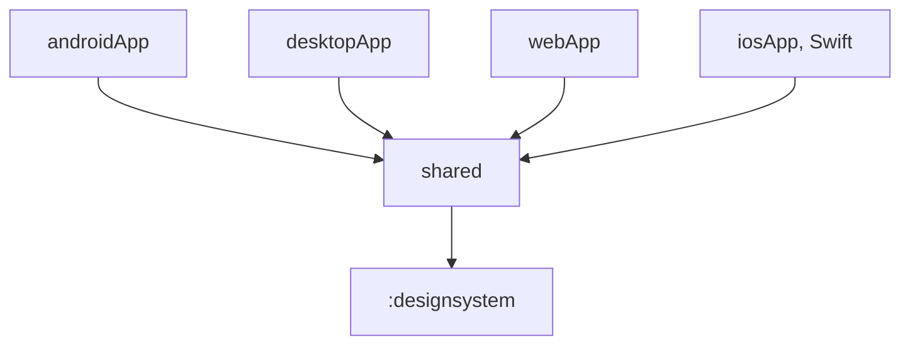

# ADR-6: The design system is the `:designsystem` module

- **Status:** Accepted
- **Date:** 2026-10-09

## Context

The Figma file has a design system: colour, spacing and radius tokens, text styles, icons and
components. The screens in Figma use only these components. The code must use the same parts.
Otherwise the app and the design differ, and each feature builds its own buttons and fields.

All code was in the `shared` module. [ADR-2](ADR-2-internal-by-default.md) prepares `shared` for a
split into several modules. The design system has no dependency on a feature. Thus it is the first
part that can be a module of its own.

## Decision

### 1. The module

The Gradle module `:designsystem` holds the design system. The `shared` module uses it.

The diagram shows the dependencies between the modules.

The module has three packages under `eu.alsk.transmissionremote.designsystem`:

| Package | Content |
|---|---|
| `theme/` | `AppTheme`, the colour schemes, `StatusColors`, `Spacing`, `Radius`, `Elevation` |
| `icon/` | `AppIcons`: the icons of the design system |
| `component/` | The components, one in each file ([ADR-3](ADR-3-composable-conventions.md)) |

[Design system](../reference/design-system.md) lists the tokens and the components.

### 2. Figma is the source of the tokens

The tokens in the code have the same values as the tokens on the page "Design System" of the
Figma file:

| Figma | Code |
|---|---|
| Colour variable, for example `primary-container` | A role of `AppTheme.colors`, for example `primaryContainer` |
| `success`, `info`, `warning` and their containers | `AppTheme.statusColors` |
| Text style, for example `Title/Medium` | `AppTheme.typography.titleMedium` |
| `space/16` | `Spacing.s16` |
| `radius/lg` | `Radius.lg` |
| `Elevation/3` | `Elevation.level3` |
| Icon component `Icon/<name>` | `AppIcons.<Name>` |

When you change a token, change it in Figma and in the code in the same change.

### 3. Content

- The module holds generic components only: buttons, fields, lists, menus, bars, dialogs, sheets,
  banners and the logo.
- A component that shows data of one feature is not in the module. Examples are the torrent row
  and the server row. Put it in the `views/` package of the feature
  ([ADR-1](ADR-1-feature-packages-and-file-layout.md)). Build it from the components of the module.
- The icons come from the Lucide library. Only `AppIcons` uses the library. Feature code uses
  `AppIcons`.

### 4. Public API

- The module enables `explicitApi()`. Each declaration needs a visibility modifier.
- The tokens, the icons and the components are `public`, because `shared` calls them. All other
  declarations are `internal` or `private`.
- Material 3 is an `api` dependency of the module, because `AppTheme.colors` and
  `AppTheme.typography` use Material 3 types.
- The component names have no prefix, for example `Button` and `TextField`. In a file of the
  module, import a Material 3 component with an alias when the names are the same.

### 5. Use in feature code

- Use a component of the module when the module has one. Do not use the Material 3 component.
- Use the tokens for colours, sizes and spacing. Do not write colour values or icon paths in
  feature code.
- Feature code can use the Material 3 parts that the module does not wrap, for example
  `Scaffold`.

### 6. Add a component

1. Add the component to the page "Design System" in Figma.
2. Add a file to `component/`. Obey [ADR-3](ADR-3-composable-conventions.md): previews in light
   and dark, config values as plain parameters, KDoc on each public declaration.
3. Add the component to [Design system](../reference/design-system.md).

## Consequences

- Features look the same, because they use the same components and tokens.
- A change to a token or a component is in one place.
- `shared` compiles less code. Gradle can compile `:designsystem` in parallel and from its cache.
- A new component needs a Figma change, a code change and a doc change.
- The module is a step to the module split in ADR-2. Its public API is explicit from the start.
