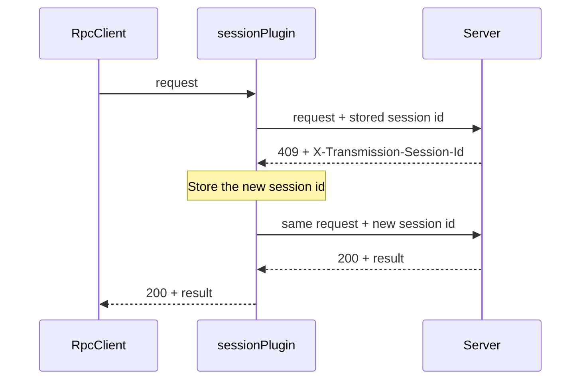

# ADR-7: The `rpc` block sends the RPC requests

- **Status:** Accepted
- **Date:** 2026-10-09

## Context

The app talks to the Transmission server over HTTP. Each request must obey the transport rules of
section 2 of the [RPC reference](../reference/transmission-rpc-api.md):

- HTTP Basic authentication, when the server asks for a password.
- The session id: the first request gets HTTP 409 with the session id. The client stores the id
  and sends the request again.
- Two wire formats: JSON-RPC 2.0 for Transmission 4.1 and later, and the legacy format for 4.0 and
  earlier.

These rules apply to all requests. Thus they belong in the network layer, not in each feature.

## Decision

### 1. The block

The block `blocks/rpc` (`:blocks:rpc`) holds the client. Its package is
`eu.alsk.transmissionremote.rpc`. It has no dependency on `shared` or on another block.

| Declaration | Content |
|---|---|
| `RpcClient` | Sends RPC requests to one server: `format()`, `call(method, params)`, `close()` |
| `ServerEndpoint`, `Credentials` | The RPC URL and the user name and password of one server |
| `RpcFormat` | `JsonRpc2` or `Legacy` |
| `RpcException` | The failures: `Unauthorized`, `Forbidden`, `SessionRejected`, `Http`, `ServerError`, `InvalidResponse`, `Network` |
| `torrents.TorrentsClient` | Gets the torrent list: `getTorrents()`, `getRecentlyActive()` |
| `torrents.Torrent`, `TorrentStatus`, `TorrentError`, `TorrentChanges` | The torrent data, with no dependency on the wire format |
| `sessionPlugin` (internal) | The Ktor plugin for the session id |
| `RpcEnvelope` (internal) | Builds and reads the request and response bodies of both formats |

### 2. Ktor is the HTTP client

- The block uses the Ktor client with the engine of each platform: OkHttp on Android and desktop,
  Darwin on iOS, Js in the browser.
- The Ktor `Auth` plugin sends the credentials with Basic authentication. It sends them on the
  first request. It does not wait for HTTP 401.
- A Ktor client plugin handles the session id. It is the Ktor form of an OkHttp interceptor.

### 3. The session id plugin

The diagram shows how the plugin handles HTTP 409.



- The plugin sends a request again one time only. A second HTTP 409 goes to the caller as
  `RpcException.SessionRejected`. Thus the plugin cannot loop.
- The plugin also stores the `X-Transmission-Rpc-Version` header of the HTTP 409. The client uses
  it to select the wire format.

### 4. The wire format

- `RpcClient.format()` finds the format on the first call and stores it. The first request is
  a legacy `session-get`, because all server versions accept the legacy format.
- When the HTTP 409 of that request has `X-Transmission-Rpc-Version`, the format is `JsonRpc2`.
  Otherwise, it is `Legacy`.
- A server with no session id check sends no HTTP 409. Then the client reads
  `rpc-version-semver` from the reply. Version 6 or later means `JsonRpc2`.

### 5. Method clients

- `RpcClient.call(method, params)` takes the method name and the params in the format that
  `format()` returns. It returns the `result` (JSON-RPC 2.0) or the `arguments` (legacy).
- A **method client** gives typed access to one group of RPC methods. It uses `RpcClient`. It
  hides the wire format from the caller. Each group has its own package in the block, for example
  `rpc.torrents` with `TorrentsClient`. Later groups follow the same pattern, for example
  `rpc.session`.
- A method client keeps the names of each field in both formats in one internal table, for example
  `TorrentField`: `hash_string` and `hashString`.
- A method client requests only the fields that its model holds. Section 7.2 of the RPC reference
  explains why.
- The models do not depend on the wire format. The method client converts the special values:
  - An `eta` of -1 or -2 becomes null.
  - An `upload_ratio` of -1 becomes null, and -2 becomes `Double.POSITIVE_INFINITY`.
  - A `status` or an `error` code that the client does not know becomes `Stopped` or
    `LocalError`. Thus a newer server does not break the list.
- A feature uses a method client when one exists. It does not call `RpcClient.call` for that
  method.

`TorrentsClient` has two functions:

| Function | Request | Use |
|---|---|---|
| `getTorrents()` | `torrent_get` with the fields of `Torrent`, no `ids` | The first load of the torrent list |
| `getRecentlyActive()` | `torrent_get` with `ids: "recently_active"` | The updates after the first load. It also returns the ids in `removed`. |

### 6. Errors

| Situation | Exception |
|---|---|
| HTTP 401 | `Unauthorized` |
| HTTP 403 | `Forbidden` |
| HTTP 409 after the retry | `SessionRejected` |
| Other HTTP status | `Http(status, body)` |
| An RPC error in the reply | `ServerError(code, message, details)`. `code` is null for the legacy format. |
| A reply that is not an RPC response | `InvalidResponse` |
| No connection, timeout | `Network(cause)` |

`Credentials.toString()` does not show the password. Thus a log or an error message cannot
contain the password.

### 7. Tests

The tests in `commonTest` use the Ktor `MockEngine`. The mock server sends HTTP 409 when a request
has no valid session id, as Transmission does. Run the tests with:

```shell
./gradlew :blocks:rpc:jvmTest
```

`RpcClientTest` tests the transport. `TorrentsClientTest` tests `TorrentsClient` with a server of
each wire format.

## Consequences

- The features do not handle HTTP status codes, session ids or wire formats. They call
  `RpcClient`.
- The first request to a server costs one more round trip, for the HTTP 409. This is the same
  cost for each Transmission client.
- The web build sees the session id only when the server or a proxy sends
  `Access-Control-Expose-Headers` (RPC reference, section 7.4).
- Each new method group needs a method client, a field table and a model. The tests must cover
  both wire formats.
