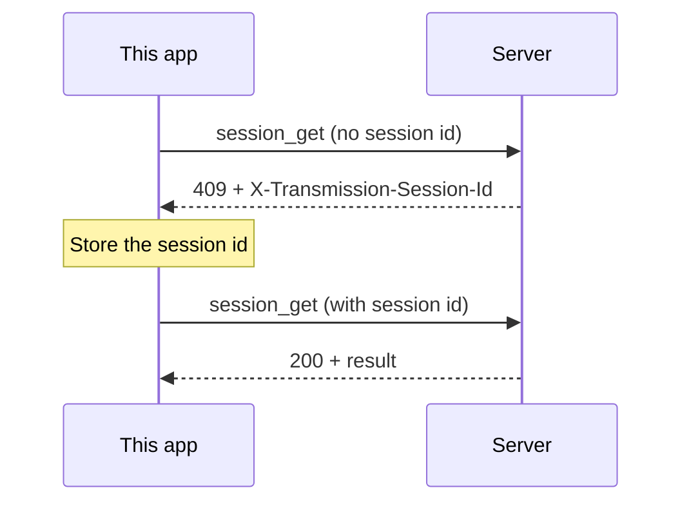

# Documentation

This document tells how to write the docs, the code comments and the commit messages in this
repository. [ADR-5](../adr/ADR-5-write-docs-in-simplified-technical-english.md) records the
decision. This document gives the procedure.

## Contents

1. [The asd-ste100 skill](#1-the-asd-ste100-skill)
2. [Modes](#2-modes)
3. [Rules](#3-rules)
4. [Words in this project](#4-words-in-this-project)
5. [Diagrams and charts](#5-diagrams-and-charts)
6. [Kinds of documents](#6-kinds-of-documents)
7. [Format](#7-format)
8. [Procedure](#8-procedure)
9. [Examples](#9-examples)

---

## 1. The asd-ste100 skill

The project uses the
[`asd-ste100` skill](https://github.com/danyuchn/asd-ste100-skill) by danyuchn. The skill applies
the rules of ASD-STE100 (Simplified Technical English, STE) to general English. STE removes words
with more than one meaning and sentences with more than one possible structure.

The skill is in `.claude/skills/asd-ste100/`:

| File | Content |
|---|---|
| `SKILL.md` | The rules, the modes and the procedure of the skill |
| `references/writing-rules.md` | A summary of the 9 rule sections of STE |
| `examples/before-after.md` | Rewrites before and after the rules |
| `scripts/ste-lint.py` | A linter for the structural rules. It uses only the Python standard library. |
| `UPSTREAM.md` | The upstream commit of the copy |
| `LICENSE` | MIT license |

Claude Code finds the skill automatically, because the skill is in `.claude/skills/`. Other agents
must read `SKILL.md` before they write text.

Do not edit the files of the skill. To update the skill, do these steps:

1. Get the hash of the newest upstream commit:

   ```shell
   git ls-remote https://github.com/danyuchn/asd-ste100-skill HEAD
   ```

2. If the hash is the same as the hash in `UPSTREAM.md`, stop. The copy is current.
3. Copy the upstream files into `.claude/skills/asd-ste100/`. Do not copy `README.md` or the git
   data.
4. Write the new hash and the date in `UPSTREAM.md`.
5. Run the self-test of the linter:

   ```shell
   python3 -I .claude/skills/asd-ste100/scripts/ste-lint.py --selftest
   ```

## 2. Modes

The skill has two modes. Select the mode from the kind of text.

| Text | Mode |
|---|---|
| `AGENTS.md` | Strict |
| Procedures and numbered steps, in any file | Strict |
| Commands and their descriptions | Strict |
| KDoc and code comments | Strict |
| Text in the UI: labels, errors, messages | Strict |
| `README.md` | STE-flavored |
| ADRs and proposals | STE-flavored |
| `docs/reference/` | STE-flavored |
| Commit messages | STE-flavored |

- **Strict:** Apply all rules. Use one word for one meaning in all of the text.
- **STE-flavored:** Apply all structural rules. Treat the word rules as advice.

## 3. Rules

The structural rules apply in both modes:

- Use the active voice. Name the actor: "The server returns 409", not "409 is returned".
- Use simple tenses. Keep a compound tense only when it carries meaning, for example "may have
  failed".
- Write one instruction in one sentence.
- Keep an instruction to 20 words or fewer. Keep a description to 25 words or fewer.
- Do not use semicolons. Make two sentences.
- Do not use phrasal verbs: "start", not "spin up". "Remove", not "take off".
- Use a verb for an action: "check the file", not "do a check of the file".
- Do not use marketing adjectives: "seamless", "robust", "powerful", "blazing-fast".
- Do not stack more than three nouns: "server configuration storage" is the limit.
- Do not omit words to save space. Keep the subject, the verb and the article.
- Keep each hedge. "May fail" must not become "fails".
- Write one topic in one paragraph. Keep a paragraph to 6 sentences or fewer.
- Use a list for 3 or more steps or conditions. Use a numbered list when the order is important.

The word rules are strict only in the Strict mode:

- Use one word for one meaning. Use one name for one thing.
- Use one part of speech for a word. "Apply oil", not "oil the valve".
- Define a term when the reader possibly does not know it.

`SKILL.md` gives the full rules and the reasons for them.

## 4. Words in this project

Use these words with these meanings only. Do not use the synonyms in the last column.

| Word | Meaning | Do not use |
|---|---|---|
| server | The Transmission daemon, or a Transmission app with remote access | daemon (except in a quote or an identifier), backend, host (for the whole server) |
| host | The host name or IP address part of the server address | server, address |
| this app | The client in this repository | the client, our app |
| user | The person who uses this app | customer, client |
| server configuration | The data that this app keeps for one server: name, address, credentials | connection, profile, account |
| feature | A part of this app that the user sees as a unit. One root package. See [Features](features.md). | module (a module is a Gradle module) |
| screen | A feature that fills the window | page, view (except `views/`) |
| remove | Take a torrent off the server list | delete (use "delete" only for files on the disk) |
| check | Examine a value against a rule or an expected value | verify, confirm, validate (except in an identifier) |
| session id | The value of `X-Transmission-Session-Id` | CSRF token, session token |

Add a word to this table when a new document needs one meaning for it.

## 5. Diagrams and charts

A diagram is often easier to read than text. Use a diagram when the subject has a shape: a flow,
a sequence, a set of states or a structure. Then write a short text that tells what the diagram
shows. The text does not repeat the diagram.

Write diagrams in [Mermaid](https://mermaid.js.org/). GitHub, GitLab and the IDEs render Mermaid
in Markdown. The diagram source is text, so a code review can show the changes. Do not add images
of diagrams. An image becomes old, and a review cannot show its changes.

Select the diagram type from the subject:

| Subject | Mermaid type | Example in this project |
|---|---|---|
| Navigation between screens | `flowchart` | Splash → Welcome or TorrentList |
| A request and its replies | `sequenceDiagram` | The session id handshake (409, then retry) |
| The states of an object | `stateDiagram-v2` | Torrent status: stopped, queued, checking, downloading, seeding |
| Packages and their dependencies | `flowchart` or `classDiagram` | Feature packages that use `data/` and `theme/` |
| Data and its fields | `classDiagram` or `erDiagram` | `ServerConnection`, the content state of a screen |
| Work in time | `gantt` or `timeline` | A release plan |
| Shares of a total | `pie` | Not often useful in docs |
| Values that change | `xychart-beta` | Poll interval and the number of requests |

Obey these rules for diagrams:

- Apply the STE rules to the labels in a diagram. Use the words in
  [section 4](#4-words-in-this-project).
- Use the same names in the diagram and in the text.
- Keep a diagram to approximately 15 nodes or fewer. Make two diagrams for a larger subject.
- Give each diagram a sentence before it. The sentence tells what the diagram shows.
- Use a table, not a diagram, for a list of values with no structure.
- Do not set colors in a diagram. The renderer selects the colors for the light theme and the
  dark theme.

This example shows the session id handshake from the
[RPC reference](transmission-rpc-api.md#22-csrf-protection-x-transmission-session-id):



## 6. Kinds of documents

| Document | Location | Structure |
|---|---|---|
| Agent guide | `AGENTS.md` | Commands, architecture, conventions. A summary of each ADR. |
| ADR | `docs/adr/ADR-N-title.md` | Copy `docs/adr/template.md`. Sections: Context, Decision, Consequences. |
| Proposal | `docs/proposals/PROPOSAL-N-title.md` | Sections: Problem, Options, Proposal, Consequences, Open questions |
| Reference | `docs/reference/<title>.md` | A title, a short purpose, a contents list, numbered sections |
| Docs index | `docs/README.md` | One table row or one list item for each document |
| KDoc | Kotlin source | See below |
| Code comment | Kotlin source | See below |
| Commit message | git | See below |

**KDoc:**

- Start with a verb in the present tense for a function: "Builds the RPC URL."
- Start with "Holds" or a noun phrase for a class: "Holds the connection details for …".
- Tell what the declaration does and why. Do not repeat the name of the declaration.
- Write KDoc for a declaration when its name does not tell all of the meaning.

**Code comments:**

- Tell why the code does something. The code tells what it does.
- Do not leave old code in a comment.

**Commit messages:**

- Write the subject in the imperative: "Add the features reference".
- Keep the subject to 72 characters or fewer.
- Write a body that tells what changed and why. Wrap the body at 72 characters.

When you add a document to `docs/`, add it to `docs/README.md` in the same change.

## 7. Format

- Wrap Markdown text at 100 characters. Do not wrap tables, links or code.
- Use `#` for the title, and `##` for the sections. Number the sections in a long document.
- Use relative links between the documents of this repository.
- Give the language of each code block: `shell`, `kotlin`, `json`, `mermaid`.
- Write identifiers, file names, commands and protocol names in backticks.
- Use **bold** only for a word that the reader must not miss, for example a warning.

## 8. Procedure

Do these steps for each change to a document:

1. Select the mode (see [section 2](#2-modes)).
2. Write the text. Use the words in [section 4](#4-words-in-this-project).
3. Find the parts that have a shape. Add a diagram for each part (see
   [section 5](#5-diagrams-and-charts)).
4. Run the linter on each changed Markdown file:

   ```shell
   python3 -I .claude/skills/asd-ste100/scripts/ste-lint.py <file.md>
   ```

5. Fix each finding. Keep a finding when the rewrite changes the meaning, for example in a quoted
   protocol term or an identifier.
6. Check the sentence length yourself. The linter counts the words on one line only. Thus it does
   not find a long sentence that continues on the next line.
7. Update `docs/README.md` and `AGENTS.md` when the change adds a document or changes a rule.

Do not rewrite these items:

- Code, identifiers, commands and quoted protocol names.
- Text that a quote marks as the words of another source.
- Files that the repository copies from other projects, for example the skill.

## 9. Examples

| Rule | Before | After |
|---|---|---|
| Active voice | The session id is stored by the client. | This app stores the session id. |
| No phrasal verb | Set up the proxy before you spin up the web build. | Configure the proxy. Then start the web build. |
| One instruction per sentence | Open the project and run the build, then check the logs. | Open the project. Run the build. Check the logs. |
| No semicolon | The server returns 409; store the new id. | The server returns 409. Store the new id. |
| Verb for an action | Perform validation of the form. | Check the form. |
| One name for one thing | Save the connection, then pick a profile from the server list. | Save the server configuration. Then select a server configuration from ServerList. |
| Keep the hedge | The request may have failed. | The request may have failed. Do not write "The request failed." |
| No marketing adjective | A seamless, blazing-fast torrent list. | The torrent list updates every 2 seconds. |
