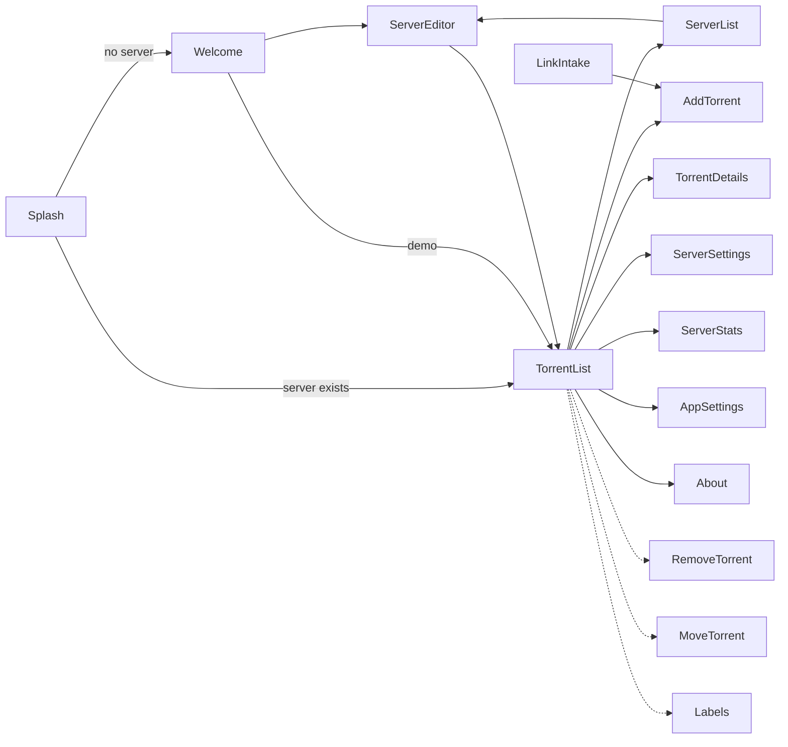

# Features

This document lists the features of this app. A feature is one part of the app that the user sees
as a unit, for example a screen or a dialog. Each feature gets one root package
([ADR-1](../adr/ADR-1-feature-packages-and-file-layout.md)).

The list includes features that do not exist yet. The list is a plan, not a decision. Before you
build a feature, check the open [proposals](../proposals/) and the [ADRs](../adr/).

In this document, "server" means the Transmission daemon. "Server configuration" means the data
that this app keeps for one server: the name, the address and the credentials. The RPC sections
refer to the [Transmission RPC API](transmission-rpc-api.md).

The [Figma design file](https://www.figma.com/design/2UXyddsaD6zijr7h0kdmox) shows the mobile
screens of these features. The page "Screens" has four flows: A (onboarding and servers), B
(torrent list), C (torrent details and add torrent) and D (server settings and about). A section
of this document gives the codes of its screens, for example "Figma: A2". The design is a
proposal, not a decision.

## Contents

1. [Status values](#1-status-values)
2. [Summary](#2-summary)
3. [Server features](#3-server-features)
4. [Torrent features](#4-torrent-features)
5. [Session features](#5-session-features)
6. [App features](#6-app-features)
7. [Shared parts](#7-shared-parts)
8. [Open questions](#8-open-questions)

---

## 1. Status values

| Status | Meaning |
|---|---|
| Done | The feature exists in the code and works. |
| Partial | Some of the feature exists in the code. The section of the feature tells what is missing. |
| Planned | The app needs the feature. No code exists yet. |
| Idea | The feature is optional. The team has not decided to build it. |

## 2. Summary

The "Package" column gives the root package of the feature. A package in *italics* does not exist
yet. The name is a suggestion.

| Feature | Kind | Package | Status | RPC |
|---|---|---|---|---|
| [Splash](#31-splash) | Screen | `splash/` | Done | — |
| [Welcome](#32-welcome) | Screen | *`welcome/`* | Planned | — |
| [ServerEditor](#33-servereditor) | Screen | `connection/` | Partial | 2, 7.1 |
| [ServerList](#34-serverlist) | Bottom sheet | *`serverList/`* | Planned | — |
| [DemoServer](#35-demoserver) | Mode | *`demo/`* | Planned | — (stub) |
| [TorrentList](#41-torrentlist) | Screen | *`torrentList/`* | Planned | 4.2, 4.3, 5.2, 5.3, 5.6, 7.2 |
| [TorrentDetails](#42-torrentdetails) | Screen | *`torrentDetails/`* | Planned | 4.3, 4.4, 4.8 |
| [AddTorrent](#43-addtorrent) | Screen or sheet | *`addTorrent/`* | Planned | 4.5, 5.3, 7.3 |
| [RemoveTorrent](#44-removetorrent) | Dialog | *`removeTorrent/`* | Planned | 4.6 |
| [MoveTorrent](#45-movetorrent) | Dialog | *`moveTorrent/`* | Planned | 4.7, 5.3 |
| [Labels](#46-labels) | Dialog | *`labels/`* | Planned | 4.4 |
| [TurtleMode](#51-turtlemode) | Toggle | *`turtleMode/`* | Planned | 5.1 |
| [ServerSettings](#52-serversettings) | Screen | *`serverSettings/`* | Planned | 5.1, 5.4, 5.5 |
| [ServerStats](#53-serverstats) | Screen | *`serverStats/`* | Planned | 5.2 |
| [ServerInfo](#54-serverinfo) | Screen | *`serverInfo/`* | Planned | 5.1, 5.8 |
| [BandwidthGroups](#55-bandwidthgroups) | Screen | *`bandwidthGroups/`* | Idea | 5.7 |
| [AppSettings](#61-appsettings) | Screen | *`appSettings/`* | Planned | — |
| [About](#64-about) | Screen | *`about/`* | Planned | 5.1 |
| [LinkIntake](#62-linkintake) | Platform entry | *`linkIntake/`* | Planned | 4.5 |
| [Notifications](#63-notifications) | Background | *`notifications/`* | Idea | 4.3 |

This diagram shows the planned navigation between the screens. The dashed lines go to dialogs.

---

## 3. Server features

### 3.1 Splash

The splash screen shows the app logo, and then opens the next screen.

- **Status:** Done. The code is in `splash/views/SplashScreen.kt`. The logo is the `Logo`
  component of the `:blocks:designsystem` module.
- **Next screen:** Today, the splash screen always opens ServerEditor. After the app keeps server
  configurations, the splash screen must open one of these screens:
  - Welcome, when no server configuration exists.
  - TorrentList, when a server configuration exists.
- **Figma:** A1.

### 3.2 Welcome

The Welcome screen is the first screen on the first run. It tells what the app does and opens
ServerEditor.

- **Status:** Planned.
- **Content:**
  - The app logo, a title and one short line of text.
  - A card "Connect your server" with the button "Add server". The button opens ServerEditor.
  - A card "Try the demo" with the button "Open demo". The button opens TorrentList on
    DemoServer.
  - On the web build only: a note about the CORS proxy (RPC section 7.4).
- **Figma:** A2, A3 (dark).

### 3.3 ServerEditor

ServerEditor adds a server configuration or changes a server configuration.

- **Status:** Partial. The code is in the `connection/` package (`ConnectionViewModel`,
  `connection/views/ConnectionScreen.kt`). The working name of the feature and the package name are
  different. The team must decide if the package gets a new name.
- **Done:**
  - The form: name, host, port, RPC path, HTTPS, username and password.
  - The validation of the form, and the URL preview.
  - The save action to the in-memory `ConnectionRepository`.
- **Missing:**
  - The "Test" button. The button runs the connect sequence in RPC section 7.1. The button shows
    one message for each failure (401, 403, host whitelist, no connection).
  - Storage that persists after the app stops. PROPOSAL-1 is open for this item.
  - The edit mode: open an existing server configuration and change it.
  - The remove action.
- **Figma:** A4 to A12. The screens show the empty form, the validation errors, the edit mode
  and the remove dialog. They also show the test states: in progress, success, failure and host
  not allowed. A15 and A16 show the connect states after "Save": connecting, and server not
  available.

### 3.4 ServerList

ServerList shows all server configurations. The user selects the active server here.

- **Status:** Planned. The feature needs storage for more than one server configuration
  (PROPOSAL-1).
- **Actions:** Select the active server. Add a server (opens ServerEditor). Edit a server. Remove a
  server.
- **Form:** The Figma design shows ServerList as a bottom sheet. The server icon in the top bar of
  TorrentList opens the sheet. Each row shows the name, the status (connected or offline) and the
  address. DemoServer is the last row.
- **Figma:** A13.

### 3.5 DemoServer

DemoServer lets the user see the screens and try the actions of this app without a real server.

- **Status:** Planned.
- **How it works:** DemoServer is a stub of the RPC client interface in this app. It holds sample
  torrents and sample server data in memory. It sends no request over the network. The features
  use the same interface for DemoServer and for a real server.
- **Entry points:** The card "Try the demo" on Welcome. The row "Demo server" in ServerList.
- **Content:** TorrentList shows the title "Demo server" and a banner: "This is the demo server.
  The torrents are samples." The banner has the action "Add server".
- **Changes:** The user can do all actions. The app does not keep the changes after it stops.
- **Figma:** A14.

---

## 4. Torrent features

### 4.1 TorrentList

TorrentList is the main screen. The screen shows the torrents of the active server.

- **Status:** Planned.
- **Data:** The update cycle in RPC section 7.2. The first load gets all torrents. Then the app
  polls with `recently_active`.
- **Content:**
  - One row for each torrent: name, status, progress, speeds, ETA, ratio and error.
  - A summary bar: total download speed, total upload speed and free space. The data comes from
    `session_stats` and `free_space`.
  - A banner when the app cannot connect to the server.
- **Filters:** By status (all, downloading, seeding, paused, finished, error). By label. By a text
  search on the name.
- **Sort:** By name, queue position, date added, progress, speed, size or ratio.
- **Actions:** The user can select more than one torrent. The actions apply to all selected
  torrents:
  - Start, start now, stop, check the data, reannounce (RPC section 4.2).
  - Move in the queue: top, up, down, bottom (RPC section 5.6).
  - Remove (opens RemoveTorrent).
  - Move the data (opens MoveTorrent).
  - Set the labels (opens Labels).
- **Entry points:** A button that opens AddTorrent. A control for TurtleMode. A menu that opens
  the session features and AppSettings.
- **Design:** The Figma design shows these parts:
  - A top bar with the server name, the connection status and three icons: search, ServerList and
    a menu.
  - The menu has these items: Resume all, Pause all, Sort by, Speed limit (TurtleMode), Server
    settings and About.
  - A long press on a row starts the selection of more than one torrent. The top bar then shows
    the actions start, stop and remove.
- **Figma:** B1 to B16. The screens include the empty list, the loading state, the lost
  connection, the search with no results and the sort sheet.

### 4.2 TorrentDetails

TorrentDetails shows one torrent. The screen gets the heavy fields for this torrent only.

- **Status:** Planned.
- **Tabs:**

  | Tab | Content | Changes that the user can make |
  |---|---|---|
  | Overview | Size, progress, dates, ratio, location, hash, comment, creator, error | None |
  | Files | The file tree, with progress and priority for each file | Wanted or not wanted. Priority. Rename a file or folder (`torrent_rename_path`). |
  | Peers | Connected peers: address, client, progress, speeds, flags | None |
  | Trackers | Tracker state: last announce, seeds, leechers, errors | Edit the tracker list (`tracker_list`) |
  | Pieces | A map of the pieces that the server has | None |
  | Options | Speed limits, seed ratio, idle limit, peer limit, bandwidth priority, bandwidth group, sequential download | All values (`torrent_set`) |

- **Actions:** The same actions as TorrentList, for this torrent only.
- **Note:** `sequential_download` exists on Transmission 4.1+ only. Hide the option on older
  servers.
- **Design:** The Figma design shows the tabs Overview, Files, Peers and Trackers. It has no
  Pieces tab and no Options tab. A menu in the top bar holds these items: Reannounce, Move data,
  Rename, Copy magnet link, Bandwidth priority, Speed limits and Queue position. Each item opens a
  dialog or a sheet. The team must decide between the Options tab and the menu.
- **Figma:** C1 to C14.

### 4.3 AddTorrent

AddTorrent adds a torrent to the server.

- **Status:** Planned.
- **Sources** (RPC section 7.3):
  - A magnet link or a URL. The app sends `filename`.
  - A .torrent file on the device. The app sends the file as base64 in `metainfo`.
- **Options:** Download directory, with the free space of that directory. Start paused. Labels.
- **Result:** `torrent_duplicate` is not a failure. The app tells the user that the server already
  has the torrent.
- **Figma:** C15 to C19. The screens show a magnet link, a .torrent file, a link that is not
  valid, the result "added" and the result "duplicate".
- **Idea:** Select the files before the app adds the torrent. For a .torrent file, the app must
  parse the file on the device. For a magnet link, the metadata does not exist before the server
  adds the torrent.

### 4.4 RemoveTorrent

RemoveTorrent is a confirmation dialog. The dialog removes the selected torrents.

- **Status:** Planned.
- **Content:** The number of torrents, or the name of one torrent. A checkbox "Also delete the
  downloaded data" (`delete_local_data`). The default is off.
- **Safety:** The app must always send `ids`. A request without `ids` removes every torrent on
  the server (RPC section 4.6).

### 4.5 MoveTorrent

MoveTorrent sets a new location for the data of the selected torrents.

- **Status:** Planned.
- **Content:** The new directory. The free space of the directory. A choice between these two
  actions:
  - Move the data to the new directory (`move: true`).
  - Find the data in the new directory (`move: false`).

### 4.6 Labels

Labels sets the labels of the selected torrents.

- **Status:** Planned.
- **Content:** The labels that the torrents have now. A list of the labels on the server, to
  select from. A field to add a new label.
- **Note:** `labels` replaces all labels of a torrent. For more than one torrent, the app must
  decide how to merge the labels. See [Open questions](#8-open-questions).

---

## 5. Session features

### 5.1 TurtleMode

TurtleMode turns the alternative speed limits on or off with one tap (`alt_speed_enabled`).

- **Status:** Planned.
- **Location:** A control on TorrentList. ServerSettings holds the limits and the schedule.
- **Note:** TurtleMode is small. It can be a part of TorrentList and not a separate feature
  package.

### 5.2 ServerSettings

ServerSettings shows and changes the settings of the server (`session_get`, `session_set`).

- **Status:** Planned.
- **Sections** (from RPC section 5.1):
  - Speed: global limits, turtle-mode limits and the turtle-mode schedule.
  - Downloads: default directory, incomplete directory, `.part` names, start added torrents.
  - Queue: download queue size, seed queue size, stalled torrents.
  - Seeding: default seed ratio, idle limit.
  - Network: peer port, port forwarding, peer limits, encryption, DHT, PEX, LPD. A "Test port"
    button (`port_test`).
  - Blocklist: on or off, URL, number of rules. An "Update" button (`blocklist_update`).
- **Note:** Some fields exist on some server versions only. Show only the fields that the server
  returns.
- **Figma:** D1 to D10. The design has no Blocklist section yet.

### 5.3 ServerStats

ServerStats shows the statistics of the server (`session_stats`).

- **Status:** Planned.
- **Content:** Two groups: "This session" (`current_stats`) and "All time" (`cumulative_stats`).
  Each group shows uploaded bytes, downloaded bytes, ratio, files added and active time.

### 5.4 ServerInfo

ServerInfo shows the version data of the server and the dangerous server actions.

- **Status:** Planned.
- **Content:** Transmission version, RPC version, wire format (JSON-RPC 2.0 or legacy), config
  directory.
- **Actions:** Stop the server (`session_close`). The app must show a confirmation dialog first.
- **Note:** ServerInfo can be one section of ServerSettings. Then it is not a separate feature.

### 5.5 BandwidthGroups

BandwidthGroups shows and changes the bandwidth groups of the server (`group_get`, `group_set`).

- **Status:** Idea. Few users use bandwidth groups. The methods exist on Transmission 4.0+ only.

---

## 6. App features

### 6.1 AppSettings

AppSettings holds the settings of this app. These settings are not server settings.

- **Status:** Planned.
- **Settings:**
  - Theme: system, light or dark.
  - Polling interval for TorrentList.
  - Units: the server units or fixed units.
  - A link to About.

### 6.2 LinkIntake

LinkIntake receives magnet links and .torrent files from other apps, and opens AddTorrent.

- **Status:** Planned.
- **Platforms:**
  - Android: an intent filter for `magnet:` links and for .torrent files.
  - iOS: a URL scheme for `magnet:` links and a document type for .torrent files.
  - Desktop: an argument on the command line, or a file that the user drops on the window.
  - Web: a `registerProtocolHandler` call for `magnet:` links, if the browser permits it.
- **Note:** Most code in this feature is platform code. The feature needs `expect`/`actual`
  declarations or code in the entry-point modules.

### 6.3 Notifications

Notifications tells the user when a download is complete.

- **Status:** Idea.
- **Problem:** The app must poll the server in the background. Each platform limits background
  work in a different way. The web build cannot do it.

### 6.4 About

About shows the version data of this app and of the server.

- **Status:** Planned.
- **Content:** The app name and version. The Transmission version and the RPC version of the
  server. Links to the source code, the open-source licenses and the privacy text.
- **Note:** About and ServerInfo both show the server version. ServerInfo can become a part of
  About. See [Open questions](#8-open-questions).
- **Figma:** D11, D12.

---

## 7. Shared parts

These parts are not features. Several features use them. ADR-1 puts them in root packages that
have the name of their role.

| Part | Package | Status | Used by |
|---|---|---|---|
| RPC client: transport, session id, wire format, errors | *`rpc/`* | Planned | All features that talk to the server |
| Demo RPC client: the stub for DemoServer, with sample data | *`rpc/`* or *`demo/`* | Planned | DemoServer and all features that talk to the server |
| Server configuration storage | `data/` | Partial (in memory only) | ServerEditor, ServerList, Splash |
| Formatters: size, speed, ETA, ratio, dates | *`format/`* | Planned | TorrentList, TorrentDetails, ServerStats |
| Connection state: online, offline, auth failure | *`rpc/`* or `data/` | Planned | TorrentList, all session features |
| Design system: theme, icons, components | `:blocks:designsystem` module | Done | All features |

## 8. Open questions

- Does the `connection/` package get the name `serverEditor/`?
- Is ServerList a bottom sheet, as in the Figma design, or a separate screen?
- Labels: when the user changes the labels of more than one torrent, does the app replace the
  labels or add to them?
- Is TurtleMode a separate feature package, or a part of TorrentList?
- Is ServerInfo a separate screen, a section of ServerSettings, or a part of About?
- TorrentDetails: does the app use an Options tab, or the menu and the sheets in the Figma design?
- DemoServer: does the stub live in `rpc/` or in its own `demo/` package?
- Does the app need a navigation library when it has more than three screens? Today, `App.kt`
  uses an enum and a `Crossfade`.
